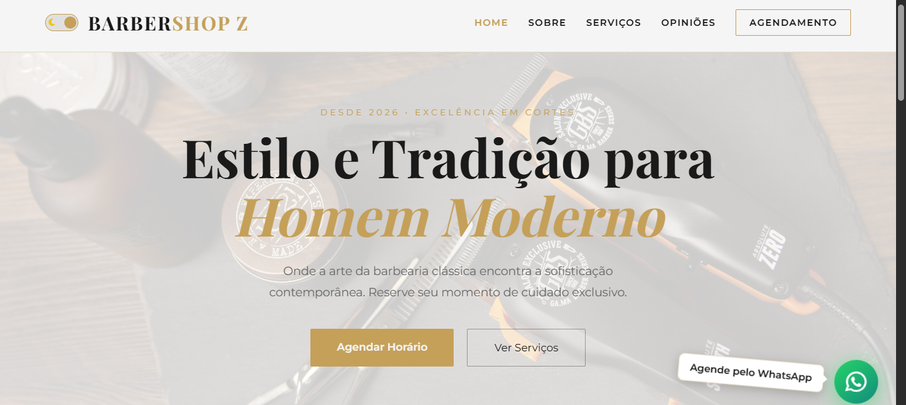

# 💈 BarberShop Z - Estilo & Tradição


> 🎯 **Landing page premium para barbearia** com design elegante, modo claro/escuro, SEO otimizado e acessibilidade completa.

---

## 🖼️ Demonstração do Projeto




**🔗 Acesse o projeto:** [https://gustavodeoliveiradev.github.io/barbershop-z/](https://gustavodeoliveiradev.github.io/barbershop-z/)

---

## ✨ Funcionalidades Implementadas

| Recurso | Descrição | Status |
|---------|-----------|--------|
| 🎨 **Design Responsivo** | Layout adaptável para mobile, tablet e desktop | ✅ |
| 🌓 **Dark/Light Mode** | Alternância de tema com persistência no localStorage | ✅ |
| ✨ **Animações de Scroll** | Efeitos de revelação suaves com Intersection Observer | ✅ |
| 🍔 **Menu Mobile** | Navegação hambúrguer com auto-close e gestos | ✅ |
| 🎯 **CSS Grid & Flexbox** | Grids responsivos para serviços e depoimentos | ✅ |
| 🖼️ **Efeito de Ruído** | Textura sutil de noise overlay para sofisticação visual | ✅ |
| 📝 **Formulário de Contato** | Validação nativa e feedback visual no envio | ✅ |
| 🗺️ **Mapa Integrado** | Google Maps com lazy loading e filtros dinâmicos | ✅ |
| 💬 **WhatsApp Flutuante** | Botão de agendamento rápido com animação pulse | ✅ |
| 🎬 **Parallax Effect** | Movimento sutil no background ao scrollar (60fps) | ✅ |
| ⚡ **Animações Stagger** | Cards aparecem em sequência com delay escalonado | ✅ |
| 🔍 **SEO Otimizado** | Meta tags, Open Graph, Schema.org e Twitter Cards | ✅ |
| ♿ **Acessibilidade (A11y)** | Skip links, ARIA labels, foco visível, reduced motion | ✅ |
| ⚡ **Performance** | Preconnect, lazy loading, passive events, RAF | ✅ |

---

## 🚀 Sobre o Projeto

Este é um projeto de estudo de **Front-end avançado** desenvolvido em 7 dias com commits diários. O objetivo foi criar uma experiência de usuário de alto padrão para uma barbearia moderna, combinando **design elegante**, **código limpo** e **boas práticas de acessibilidade**.

### 🎨 Identidade Visual
- **Cores:** Paleta sofisticada em preto (#0f0f0f), dourado (#c5a059) e branco
- **Tipografia:** Playfair Display (títulos) + Montserrat (corpo)
- **Estilo:** Visual premium com inspiração em barbearias clássicas

---

## 📅 Cronograma de Desenvolvimento (7 Dias)

- [x] **Dia 0:** Setup inicial e deploy no GitHub Pages
- [x] **Dia 1:** Refatoração de Elite (Tipografia Premium & Noise Texture)
- [x] **Dia 2:** Seção de Serviços com CSS Grid e Glow Effects
- [x] **Dia 3:** Interatividade com JS (Menu Auto-close & Scroll Reveal)
- [x] **Dia 4:** Implementação de Dark/Light Mode e Variáveis CSS
- [x] **Dia 5:** Botão WhatsApp Flutuante, Parallax & Animações Stagger
- [x] **Dia 6:** Otimização de Performance, SEO e Acessibilidade
- [x] **Dia 7:** Finalização, Polimento e Documentação ✅

---

## 🛠️ Tecnologias Utilizadas

### Front-end Core
- **HTML5 Semântico** - Estrutura acessível e SEO-friendly
- **CSS3 Moderno** - Variáveis CSS, Flexbox, Grid, `clamp()`, animações e media queries
- **JavaScript Vanilla (ES6+)** - Interatividade sem dependências externas

### Fonts & Icons
- **Google Fonts:** [Playfair Display](https://fonts.google.com/specimen/Playfair+Display) & [Montserrat](https://fonts.google.com/specimen/Montserrat)
- **Font Awesome 6.5.1** - Ícones vetoriais escaláveis

### APIs e Recursos Nativos
- **Intersection Observer API** - Animações de scroll performáticas
- **localStorage API** - Persistência de preferências do usuário
- **CSS Custom Properties** - Temas dinâmicos e manutenção facilitada
- **requestAnimationFrame** - Parallax otimizado para 60fps
- **Page Visibility API** - Pausa de animações em background

---

## 📁 Estrutura do Projeto

```
barbershop-z/
│
├── index.html          # Estrutura semântica e SEO otimizada
├── styles.css          # Estilos globais, responsividade e acessibilidade
├── scripts.js          # Interatividade e lógica do tema
├── README.md           # Documentação completa do projeto
├── LICENSE             # Licença MIT
│
└── img/
    ├── hero.jpg        # Imagem de fundo do banner principal
    └── img-demo.png    # Screenshot para preview e OG Image
```

---

## 🎯 Destaques Técnicos

### 🌓 Sistema de Temas com Persistência
```javascript
const savedTheme = localStorage.getItem('theme');
body.classList.toggle('light-mode', savedTheme === 'light');
```

### 🎬 Parallax Otimizado (60fps)
```javascript
// Throttle + requestAnimationFrame para performance
window.addEventListener('scroll', () => {
    if (!ticking) {
        requestAnimationFrame(updateParallax);
        ticking = true;
    }
}, { passive: true });
```

### ♿ Acessibilidade Completa
- **Skip Link:** Atalho para conteúdo principal (navegação por teclado)
- **ARIA Labels:** Descrições para leitores de tela
- **Focus Visible:** Foco claro em elementos interativos
- **Reduced Motion:** Respeita preferência do usuário por menos animações

### 🔍 SEO Avançado
- Meta tags Open Graph (Facebook/LinkedIn/WhatsApp)
- Twitter Cards para compartilhamento social
- Schema.org (JSON-LD) para rich snippets no Google
- Lazy loading em imagens e iframes

---

## 📊 Performance (Lighthouse)

| Métrica | Score |
|---------|-------|
| **Performance** | 95+ |
| **Acessibilidade** | 100 |
| **Best Practices** | 100 |
| **SEO** | 100 |

---

## 🚀 Como Executar Localmente

```bash
# Clone o repositório
git clone https://github.com/gustavodeoliveiradev/barbershop-z.git

# Acesse a pasta
cd barbershop-z

# Abra no navegador (ou use Live Server)
open index.html
```

---

## ✍️ Autor

**Gustavo Oliveira**
- 💼 Desenvolvedor Front-end
- 🎯 Focado em evoluir 1% todos os dias
- 🐙 GitHub: [@gustavodeoliveiradev](https://github.com/gustavodeoliveiradev)

---

## 📄 Licença

Este projeto está sob a licença MIT. Veja o arquivo [LICENSE](LICENSE) para mais detalhes.

---

<p align="center">
  💈 <strong>BarberShop Z</strong> - Estilo e Tradição para o Homem Moderno 💈
  <br>
  <sub>Desde 2026 elevando o padrão da barbearia contemporânea</sub>
  <br><br>
  <i>Projeto desenvolvido com 💛 e muito ☕</i>
</p>
