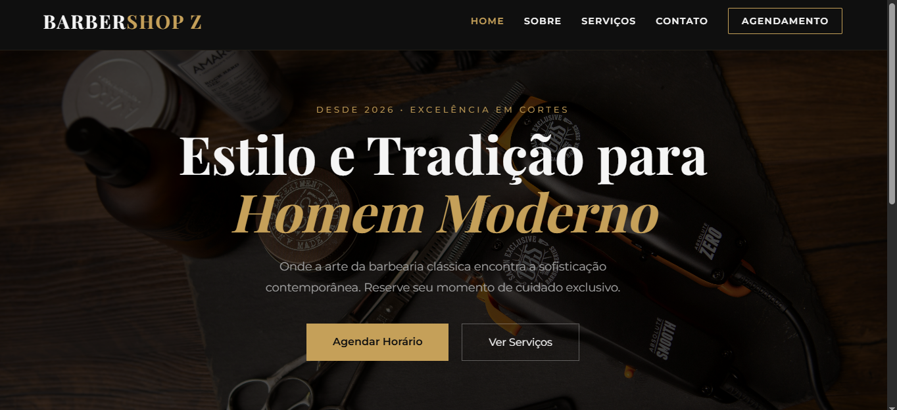

# 💈 BarberShop Z - Estilo & Tradição

## 🖼️ Demonstração do Projeto

> **Acesse o projeto:** [https://gustavodeoliveiradev.github.io/barbershop-z/](https://gustavodeoliveiradev.github.io/barbershop-z/)

## 🚀 Sobre o Projeto
Este é um projeto de estudo de Front-end focado em **Design de Elite**, tipografia premium e micro-interações avançadas. O objetivo é transformar uma base simples em uma landing page de alto padrão para uma barbearia moderna.

### 📅 Cronograma de Evolução (7 Dias)
- [x] **Dia 0:** Setup inicial e deploy no GitHub Pages.
- [x] **Dia 1:** Refatoração de Elite (Tipografia Premium & Noise Texture).
- [x] **Dia 2:** Seção de Serviços com CSS Grid e Glow Effects.
- [x] **Dia 3:** Interatividade com JS (Menu Auto-close & Scroll Reveal).
- [ ] **Dia 4:** Implementação de Dark/Light Mode e Variáveis CSS.
- [ ] **Dia 5:** Seção de Depoimentos (Opiniões) e Contato.
- [ ] **Dia 6:** Otimização de Performance e SEO.
- [ ] **Dia 7:** Finalização e Polimento de UI.

## 🛠️ Tecnologias Utilizadas
- **HTML5 Semantic:** Estrutura clara e acessível.
- **CSS3 Moderno:** Variáveis (`:root`), Flexbox, Grid e `clamp()`.
- **Google Fonts:** Playfair Display & Montserrat.
- **Font Awesome:** Ícones para interface.

## ✍️ Autor
Desenvolvido por **Gustavo Oliveira** - *Focado em evoluir 1% todos os dias.*